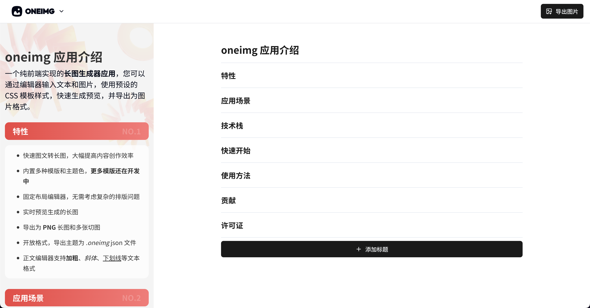

# oneimg

一个纯前端实现的长图生成器应用，您可以通过编辑器输入文本和图片，使用预设的 CSS 模板样式，快速生成预览，并导出为图片格式。



## 特性
- 快速图文转长图，大幅提高内容创作效率
- 内置多种模版和主题色，**更多模版还在开发中**
- 固定布局编辑器，无需考虑复杂的排版问题
- 实时预览生成的长图
- 导出为长图和多张切图
- 开放格式，导出主题为 `.oneimg` json 文件
- 正文编辑器支持加粗、斜体、下划线和列表等格式

## 预览地址
[oneimgai](https://oneimgai.com)

## 技术栈
- **前端**： Next.js、tiptap 编辑器、tailwindcss、shadcn/ui
- **图片处理**：html-to-image, UPNG
- **数据库**：IndexedDB (本地存储)

## 快速开始

```
# 安装依赖
pnpm install 

# 启动项目
pnpm dev
```
## 使用方法
1. 打开应用后，首先创建主题
2. 选择预设的 CSS 样式模板
3. 使用编辑器输入内容，实时预览生成的图片样式
4. 点击导出按钮，生成 PNG 格式的图片并下载。

## 贡献
我们欢迎各类贡献。如果你有新的功能或改进，欢迎提交 PR：
1. Fork 本项目。
2. 创建新的分支 (git checkout -b feature/your-feature)。
3. 提交修改 (git commit -m 'Add some feature')。
4. 推送到分支 (git push origin feature/your-feature)。
5. 创建 Pull Request。

## 许可证
本项目基于 [MIT license](https://opensource.org/licenses/MIT) 开源。
