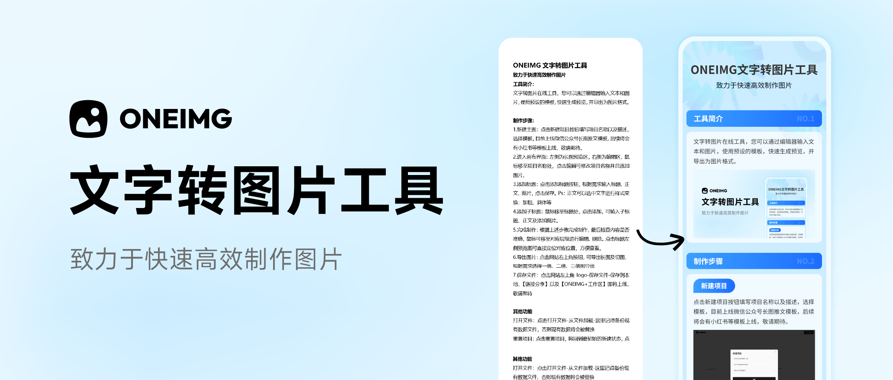

<a href="https://oneimgai.com/" target="_blank" rel="noopener">
  <picture>
    <source media="(prefers-color-scheme: dark)" alt="OneIMG" srcset="./docs/oneimg-banner.png" />
    
  </picture>
</a>

<h4 align="center">
  <a href="https://oneimgai.com">Oneimg 官网</a> |
  <a href="https://t.me/oneimg">Telegram 反馈群</a> |
  <a href="https://support.qq.com/product/673291">吐个槽</a>
</h4>

## 介绍
一个纯前端实现的文字转图片应用，您可以通过编辑器输入文本和图片，使用预设的 CSS 模板样式，快速生成预览，并导出为图片。

适合微信公众号长图推文以及小红书、Instagram 等图片社交媒体贴文制作。

https://github.com/user-attachments/assets/d12a1009-a27a-4dae-a2e5-727f3b982e3b

[如何自定义自己的模版和主题](./docs/how-to-custom-template.md)

## 特性
- 快速文字转图片，大幅提高内容创作效率
- 内置多种模版和主题色，**更多模版还在开发中**
- 固定布局编辑器，无需考虑复杂的排版问题
- 实时预览生成的长图
- 导出为长图和多张切图
- 开放格式，导出主题为 `.oneimg` json 文件
- 正文编辑器支持加粗、斜体、下划线和列表等格式

## 预览地址
[oneimgai](https://oneimgai.com)

## 技术栈
- **前端**： Next.js、tiptap 编辑器、tailwindcss、shadcn/ui
- **图片处理**：html2canvas, UPNG
- **数据库**：IndexedDB (本地存储)

## 快速开始

```
# 安装依赖
pnpm install 

# 启动项目
pnpm dev
```

## Docker 快速部署

你可以直接使用我已经构建好的镜像来运行
```sh
docker run -d -t -p 3000:3000 \
--name=oneimg \
--restart=always \
byodian/oneimg:latest

```

或者，如果您愿意，也可以自己手动编译。

```sh
#下载代码
git clone https://github.com/byodian/oneimg.git

#docker 编译
cd oneimg/
docker build -t oneimg:v1 .

#启动服务
docker run -d -t -p 3000:3000 --name oneimg --restart=always oneimg:v1
```
最后，打开你的浏览器访问服务的地址 http://localhost:3000 即可

## 使用方法
1. 打开应用后，首先创建主题
2. 选择预设的 CSS 样式模板
3. 使用编辑器输入内容，实时预览生成的图片样式
4. 点击导出按钮，生成 PNG 格式的图片并下载。

## 贡献
我们欢迎各类贡献。如果你有新的功能或改进，欢迎提交 PR：
1. Fork 本项目。
2. 创建新的分支 (git checkout -b feature/your-feature)。
3. 提交修改 (git commit -m 'Add some feature')。
4. 推送到分支 (git push origin feature/your-feature)。
5. 创建 Pull Request。

## 许可证
本项目基于 [MIT license](https://opensource.org/licenses/MIT) 开源。

## 捐赠
[支持我](./DONATIONS.md)
